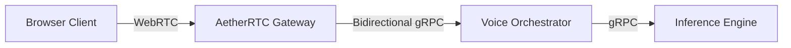
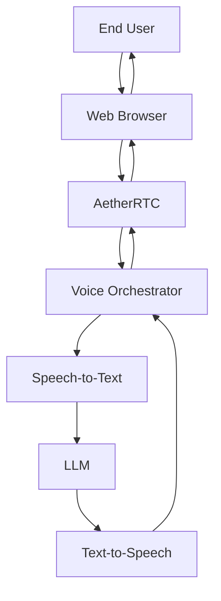
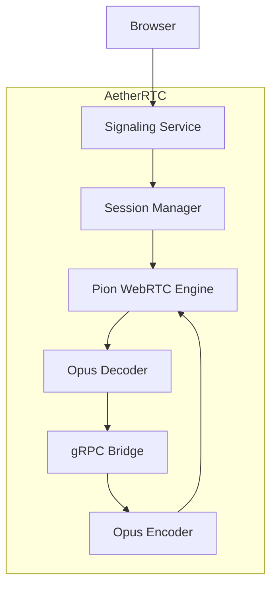
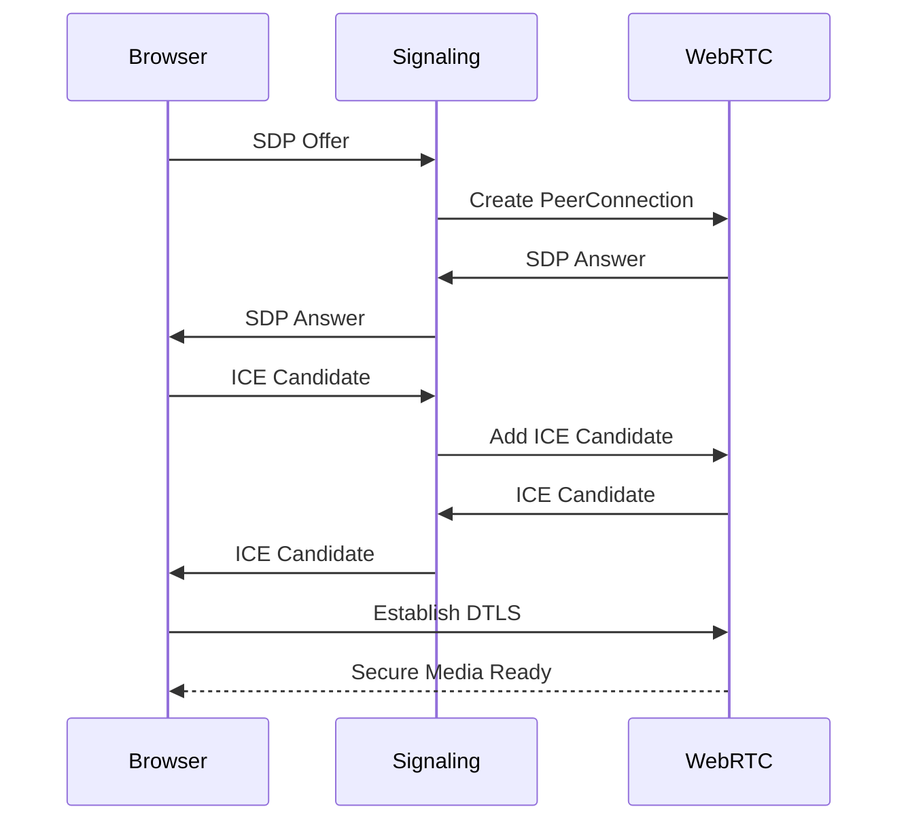
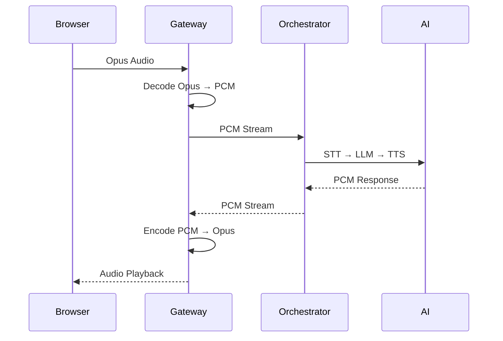
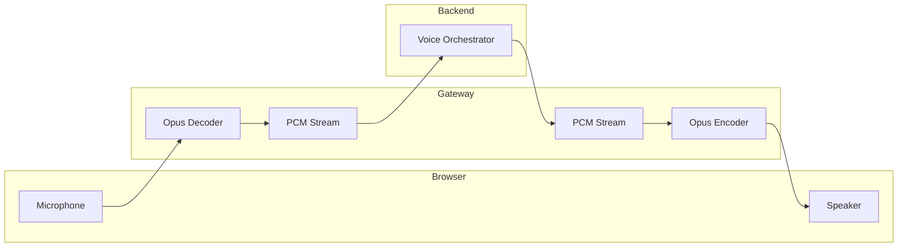
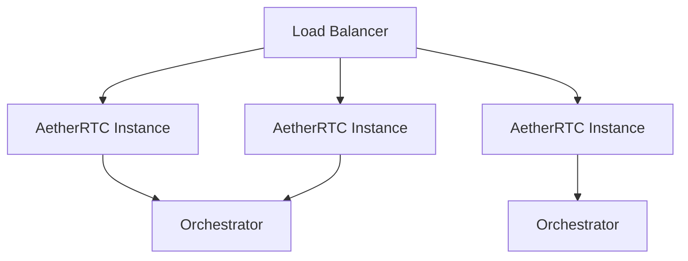
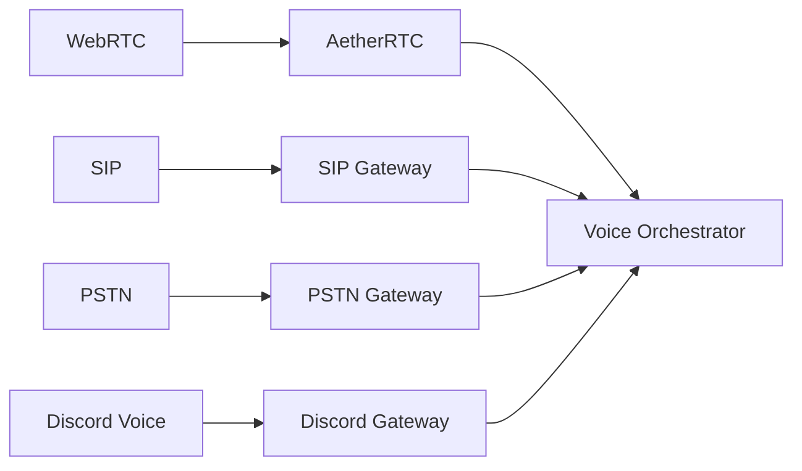
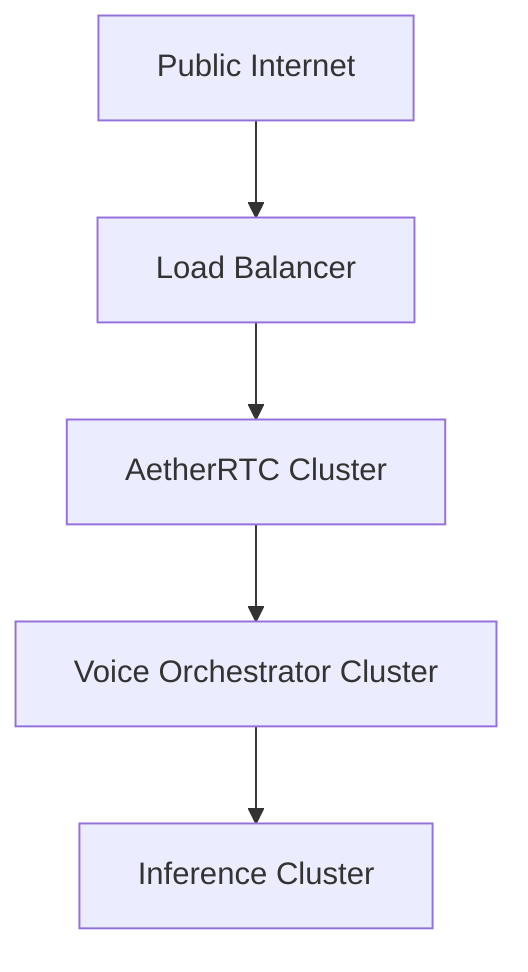
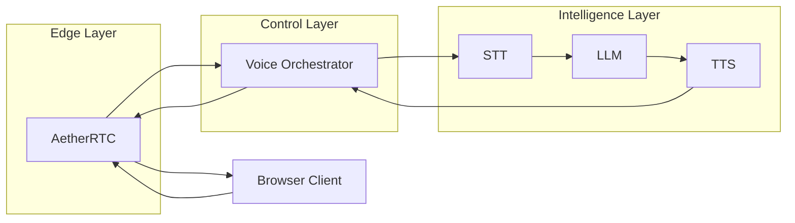

# AetherRTC

## Edge Media Gateway for Real-Time AI Voice Systems

**Version:** 1.0
**Status:** High-Level Design (HLD)
**Type:** Infrastructure Service / Edge Gateway
**Primary Language:** Go
**Core Framework:** Pion WebRTC
**Communication:** WebRTC, WebSocket, gRPC

---

# 1. Executive Summary

AetherRTC is a dedicated Edge Media Gateway responsible for terminating public-facing WebRTC connections and bridging browser-based real-time audio streams to internal AI voice infrastructure.

The service isolates complex media transport concerns—including SDP negotiation, ICE traversal, DTLS handshakes, SRTP decryption, Opus decoding, and media session management—from downstream business services.

By acting as a protocol boundary, AetherRTC enables backend services to operate exclusively on clean PCM audio streams while remaining agnostic to WebRTC-specific implementation details.

This architecture follows the same separation-of-concerns model commonly found in large-scale real-time communication platforms where transport infrastructure and application orchestration are independently deployable systems.

---

# 2. Problem Statement

WebRTC introduces significant protocol complexity:

- SDP negotiation
- ICE candidate exchange
- NAT traversal
- DTLS security handshakes
- SRTP encryption
- Opus codec handling
- Connection lifecycle management

Embedding these responsibilities inside the Voice Orchestrator would create:

- Tight coupling
- Reduced maintainability
- Increased testing complexity
- Scaling limitations
- Protocol leakage into business logic

AetherRTC solves this by introducing a dedicated protocol termination layer.

---

# 3. System Goals

## Primary Goals

### G1. Protocol Isolation

Shield internal services from all WebRTC-specific concerns.

### G2. Media Normalization

Convert external media streams into a standardized internal PCM format.

### G3. Independent Scalability

Scale media infrastructure separately from orchestration and AI workloads.

### G4. Vendor Independence

Avoid dependence on external RTC providers.

### G5. Reusability

Enable the same gateway to support:

- AI Assistants
- Voice Agents
- Live Transcription
- Voice Bots
- SIP Bridges
- Contact Centers

---

# 4. Non-Goals

AetherRTC intentionally does not perform:

- Speech-to-Text
- LLM inference
- Text-to-Speech
- Prompt Management
- Session Memory
- Business Logic
- Agent Orchestration
- User Authentication Logic

These remain responsibilities of downstream services.

---

# 5. Architectural Principles

## Principle 1 — Edge Protocol Termination

All protocol complexity terminates at the gateway boundary.

Internal systems never process:

- SDP
- ICE
- DTLS
- SRTP

---

## Principle 2 — Pure Media Transportation

AetherRTC only understands:

```text
Session ID
Audio Stream
Connection State
```

Nothing else.

---

## Principle 3 — Stateless Business Layer

The gateway maintains transport state only.

No AI state.

No conversation state.

No user context.

---

## Principle 4 — Streaming First

All communication is designed around bidirectional streams.

No request-response bottlenecks.

---

## Principle 5 — Future Transport Extensibility

Additional transport adapters should be addable without modifying downstream services.

Examples:

```text
WebRTC Gateway
SIP Gateway
PSTN Gateway
Mobile SDK Gateway
Discord Gateway
```

---

# 6. High-Level Architecture



---

# 7. System Context Diagram



---

# 8. Logical Architecture



---

# 9. Core Subsystems

---

## 9.1 Signaling Service

### Responsibilities

- WebSocket endpoint
- SDP Offer processing
- SDP Answer generation
- ICE candidate exchange
- Connection initiation

### Output

Creates a WebRTC session.

---

## 9.2 Session Manager

### Responsibilities

- Session lifecycle tracking
- PeerConnection ownership
- Stream registration
- Connection cleanup
- Metrics association

### Output

Maintains transport-level session state.

---

## 9.3 WebRTC Engine

### Powered By

Pion WebRTC

### Responsibilities

- ICE negotiation
- DTLS handshake
- SRTP handling
- RTP processing
- Data channel support (future)

---

## 9.4 Media Processing Layer

### Inbound Pipeline

```text
SRTP
→ RTP
→ Opus
→ PCM
```

### Outbound Pipeline

```text
PCM
→ Opus
→ RTP
→ SRTP
```

---

## 9.5 Internal gRPC Bridge

### Responsibilities

- Open bidirectional streams
- Deliver PCM audio
- Receive synthesized audio
- Stream health monitoring

### Interface

```text
Gateway <-> Orchestrator
```

---

# 10. Connection Establishment Flow



---

# 11. Media Streaming Flow



---

# 12. Internal Streaming Architecture



---

# 13. Scalability Model



### Horizontal Scaling

AetherRTC scales independently from:

- AI workers
- Orchestrators
- Model servers

---

# 14. Future Extension Model



---

# 15. Deployment Architecture



---

# 16. Infrastructure Requirements

### Public Endpoints

| Component | Protocol  | Purpose   |
| --------- | --------- | --------- |
| Signaling | HTTPS/WSS | SDP & ICE |
| Media     | UDP       | RTP/SRTP  |

### Internal Endpoints

| Component                | Protocol |
| ------------------------ | -------- |
| Gateway → Orchestrator   | gRPC     |
| Orchestrator → Inference | gRPC     |

---

# 17. Key Benefits

### Clean Separation of Concerns

WebRTC remains fully isolated from AI infrastructure.

### Independent Scaling

Transport and AI workloads scale separately.

### Future Protocol Expansion

Support additional transport layers without touching orchestration logic.

### Infrastructure Reusability

AetherRTC becomes a reusable media platform rather than an AI-specific component.

### Production Readiness

Aligns with architectural patterns used by enterprise RTC platforms and large-scale voice systems.

---

# Final Architecture Vision



**AetherRTC becomes the dedicated media edge of the platform, while the Voice Orchestrator remains the control plane and the AI stack remains the intelligence plane.** This separation creates a highly scalable, maintainable, and enterprise-grade real-time voice architecture.
