# AetherRTC

# Low-Level Design (LLD)

## Version 1.0

---

# 1. Runtime Architecture

AetherRTC consists of six independently bounded runtime subsystems.

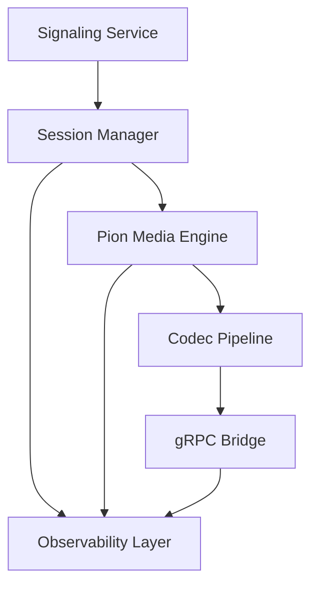

Each subsystem owns a distinct responsibility and exposes only well-defined interfaces.

---

# 2. Repository Layout

```text
aether-rtc/
├── cmd/
│   └── gateway/
│       └── main.go                 # Entry point, initializes HTTP server and gRPC clients
│
├── internal/
│   ├── signaling/
│   │   ├── server.go               # WebSocket server implementation
│   │   └── messages.go             # JSON schemas for SDP and ICE candidates
│   │
│   ├── webrtc/
│   │   ├── engine.go               # Pion WebRTC API initialization (STUN/TURN config)
│   │   ├── session.go              # Manages the lifecycle of a single PeerConnection
│   │   └── track.go                # Handles reading/writing RTP packets
│   │
│   ├── bridge/
│   │   ├── grpc_client.go          # Manages the connection pool to the Orchestrator
│   │   └── stream_manager.go       # Pipes PCM channels to/from the gRPC stream
│   │
│   └── router/
│       └── manager.go              # Maps active SessionIDs to their respective WebRTC and gRPC structs
│
├── pkg/
│   └── codec/
│       └── opus.go                 # Wrappers for encoding PCM to Opus and decoding Opus to PCM
│
├── proto/
│   └── gateway.proto               # The gRPC contract shared with the Voice Orchestrator
│
├── go.mod
└── go.sum
```

---

# 3. Session State Model

Every active user call maps to exactly one Session.

```go
type Session struct {
    ID string

    State SessionState

    PeerConnection *webrtc.PeerConnection

    AudioTrackIn  *webrtc.TrackRemote
    AudioTrackOut *webrtc.TrackLocalStaticSample

    PCMInbound  chan PCMFrame
    PCMOutbound chan PCMFrame

    GRPCStream pb.Gateway_StreamAudioClient

    Metrics *SessionMetrics

    CreatedAt time.Time

    Cancel context.CancelFunc

    Done chan struct{}
}
```

---

# 4. Session State Machine

The session manager owns all lifecycle transitions.

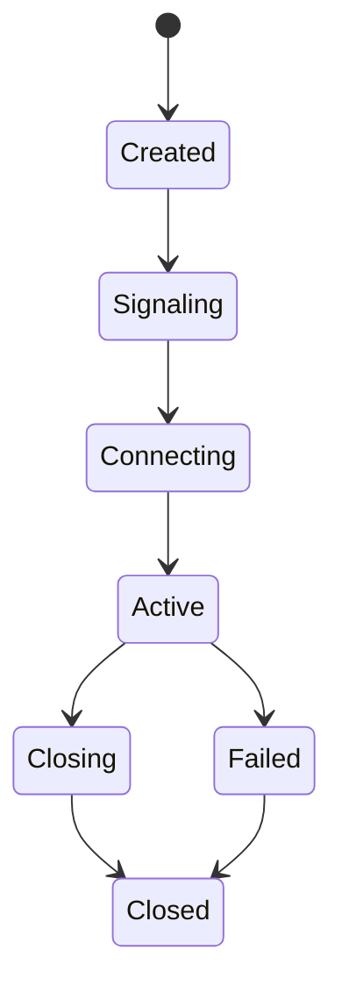

---

## State Definitions

| State      | Description        |
| ---------- | ------------------ |
| Created    | Session allocated  |
| Signaling  | SDP negotiation    |
| Connecting | ICE establishment  |
| Active     | Audio flowing      |
| Closing    | Cleanup initiated  |
| Closed     | Resources released |
| Failed     | Fatal error        |

---

# 5. Session Ownership Model

Single ownership principle.

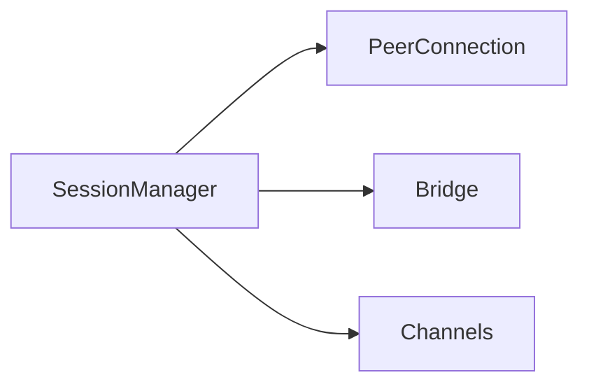

No subsystem except SessionManager may destroy a session.

This prevents race conditions.

---

# 6. Goroutine Architecture

Each session spawns fixed goroutines.

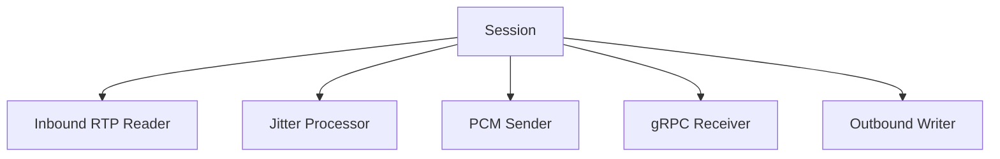

---

## Goroutine Responsibilities

### G1

Reads RTP packets

```go
track.ReadRTP()
```

---

### G2

Performs:

- sequence ordering
- jitter correction
- packet loss handling

---

### G3

Streams PCM to Orchestrator

```go
stream.Send()
```

---

### G4

Receives AI-generated PCM

```go
stream.Recv()
```

---

### G5

Writes Opus packets to browser

```go
WriteSample()
```

---

# 7. Audio Processing Pipeline

## Inbound Path

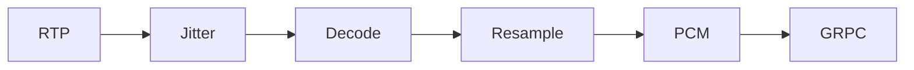

---

## Outbound Path

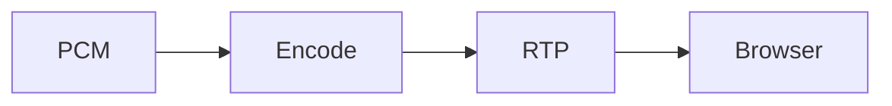

---

# 8. Memory Model

Critical for scale.

---

## Packet Pool

Avoid allocations per packet.

```go
var RTPPool = sync.Pool{
    New: func() any {
        return make([]byte, 1500)
    },
}
```

---

## PCM Pool

```go
var PCMFramePool = sync.Pool{
    New: func() any {
        return make([]byte, 3200)
    },
}
```

---

Expected reduction:

```text
GC pressure ↓ 70-90%
```

under high call volume.

---

# 9. Backpressure Design

Without backpressure:

```text
Slow AI
↓
Growing channels
↓
OOM
↓
Gateway crash
```

---

## Channel Limits

```go
PCMInbound  chan PCMFrame // cap=50

PCMOutbound chan PCMFrame // cap=50
```

---

## Policy

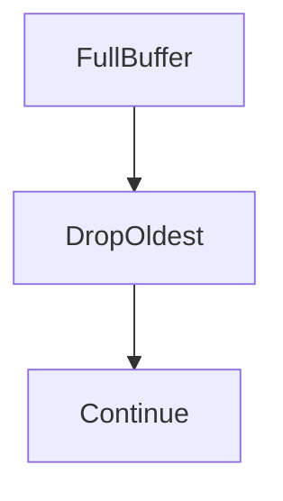

Real-time audio values freshness over completeness.

---

# 10. Jitter Buffer Design

WebRTC packets arrive:

```text
1
2
5
4
3
6
```

not

```text
1
2
3
4
5
6
```

---

Buffer architecture:

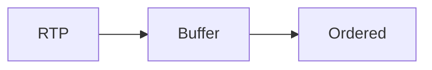

Window:

```text
20ms - 60ms
```

configurable.

---

# 11. gRPC Contract

```protobuf
service Gateway {

  rpc StreamAudio(
      stream AudioChunk
  ) returns (
      stream AudioChunk
  );
}
```

---

Message:

```protobuf
message AudioChunk {

  string session_id = 1;

  bytes pcm = 2;

  int64 timestamp = 3;

}
```

---

# 12. Failure Handling

## Browser Disconnect

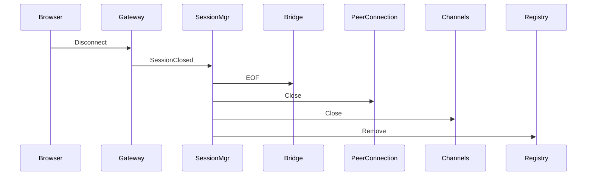

---

## gRPC Failure

```mermaid
sequenceDiagram

    Orchestrator--X Gateway

    Gateway->>Gateway: Retry

    Gateway->>SessionMgr: Failure

    SessionMgr->>Browser: End Session
```

---

# 13. Observability Design

Every session exports:

```text
active_sessions
packet_loss_rate
jitter_ms
rtt_ms
grpc_latency_ms
pcm_queue_depth
opus_decode_ms
opus_encode_ms
session_duration
```

---

Metrics Flow

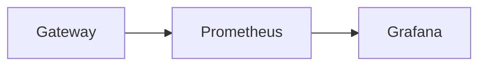

---

# 14. Security Design

## Signaling

```text
HTTPS
WSS
TLS 1.3
```

---

## Media

```text
DTLS-SRTP
AES-GCM
```

---

## Internal Traffic

```text
mTLS
gRPC
```

---

# 15. Horizontal Scaling Model

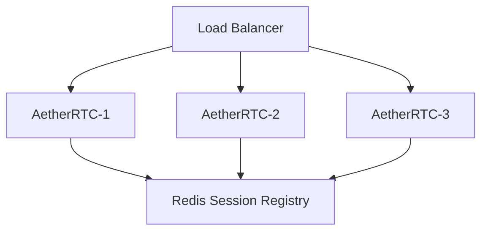

---

# 16. Capacity Planning

Per Session:

| Resource       | Approx |
| -------------- | ------ |
| RTP Buffers    | 100 KB |
| PCM Buffers    | 300 KB |
| Goroutines     | 5      |
| PeerConnection | 1      |
| gRPC Stream    | 1      |

---

Example:

```text
1000 concurrent calls

≈ 5000 goroutines

≈ 400–700 MB RAM

≈ 4–8 CPU cores
```

depending on Opus transcoding load.

---

# 17. Future Evolution

The design deliberately allows introduction of:

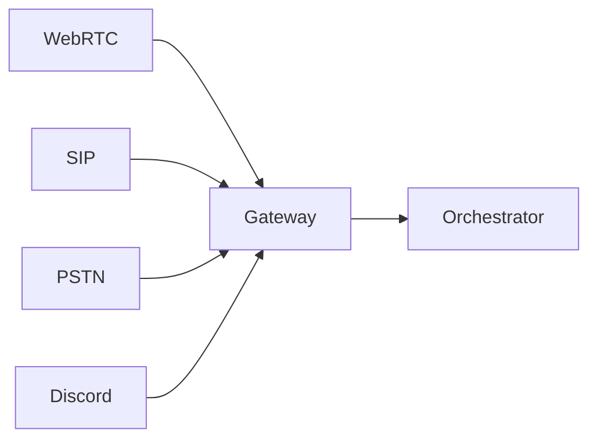

through transport adapters without modifying the orchestration layer.

---

# Architecture Summary

The final runtime architecture becomes:

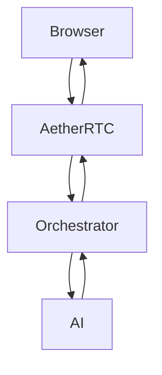

with:

- Strict protocol termination
- Session state isolation
- Bidirectional streaming
- Jitter correction
- Backpressure control
- Horizontal scalability
- Production-grade observability
- Zero business-logic coupling

This is the level of LLD that can comfortably sit beside a real RFC/ADR in a production voice platform and serve as the blueprint for implementation by multiple engineers.
