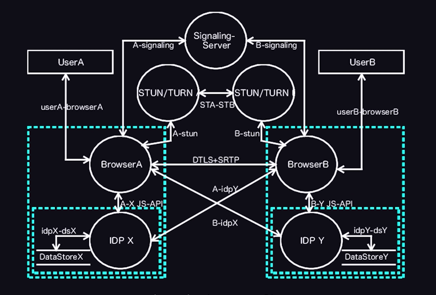

# this is the knowledge base of WebRTC

For documentation purposes, it is best to explain WebRTC as a **complete connection lifecycle**, where **SDP**, **ICE**, **STUN**, and **TURN** each play a distinct role.

A useful mental model is:

| Component        | Responsibility                                                               |
| ---------------- | ---------------------------------------------------------------------------- |
| SDP              | Describes _what_ each peer wants to communicate (audio, video, codecs, etc.) |
| Signaling        | Delivers SDP and ICE information between peers                               |
| ICE              | Determines _how_ peers can reach each other                                  |
| STUN             | Discovers public network addresses                                           |
| TURN             | Relays traffic when direct communication fails                               |
| DTLS             | Secures the connection                                                       |
| SRTP             | Encrypts audio/video streams                                                 |
| SCTP/DataChannel | Transfers arbitrary data                                                     |

---

# Complete WebRTC Connection Lifecycle

## Phase 1: Peer Initialization

Two peers want to establish a communication session.

```text
Peer A                          Peer B
(Client)                        (Client)
```

At this point:

- No connection exists.
- Neither peer knows how to reach the other.
- No media is flowing.

---

# Phase 2: Local Media Acquisition

Each peer requests access to local media devices.

```javascript
const stream = await navigator.mediaDevices.getUserMedia({
  audio: true,
  video: true,
});
```

The browser:

- Requests camera permission.
- Requests microphone permission.
- Creates local media tracks.

Result:

```text
Audio Track
Video Track
```

These tracks will later be advertised inside SDP.

---

# Phase 3: RTCPeerConnection Creation

Each peer creates a peer connection object.

```javascript
const pc = new RTCPeerConnection({
  iceServers: [
    {
      urls: "stun:stun.l.google.com:19302",
    },
    {
      urls: "turn:turn.example.com",
      username: "user",
      credential: "password",
    },
  ],
});
```

This object becomes responsible for:

- ICE
- STUN
- TURN
- DTLS
- SRTP
- Media transport

---

# Phase 4: Media Tracks Added

```javascript
stream.getTracks().forEach((track) => {
  pc.addTrack(track, stream);
});
```

Now Peer A is effectively saying:

> "I intend to send audio and video."

The browser internally prepares SDP information.

---

# Phase 5: SDP Offer Creation

Peer A creates an SDP Offer.

```javascript
const offer = await pc.createOffer();
```

Example (simplified):

```text
v=0

m=audio 9 UDP/TLS/RTP/SAVPF 111

a=rtpmap:111 opus/48000/2

m=video 9 UDP/TLS/RTP/SAVPF 96

a=rtpmap:96 VP8/90000
```

---

# What is SDP?

SDP (Session Description Protocol) is **not a transport protocol**.

It does NOT send media.

It only describes:

### Media Types

```text
audio
video
application
```

### Codecs

```text
Opus
VP8
VP9
H264
AV1
```

### Encryption

```text
DTLS-SRTP
```

### Network Information

```text
ICE username fragment
ICE password
```

### Media Directions

```text
sendrecv
sendonly
recvonly
inactive
```

Think of SDP as:

> A contract describing the session.

---

# SDP Offer Example

Peer A sends:

```text
I can send audio
I can send video

Supported codecs:
- Opus
- VP8
- H264

My ICE credentials:
ufrag=abc123
pwd=xyz456
```

---

# Phase 6: Signaling

WebRTC intentionally does NOT define signaling.

Developers must provide:

- WebSocket
- Socket.IO
- HTTP
- Firebase
- MQTT
- Custom server

Example:

```text
Peer A
   |
   | SDP Offer
   v
Signaling Server
   |
   v
Peer B
```

The signaling server only transfers metadata.

It never carries media.

---

# Phase 7: SDP Offer Processing

Peer B receives:

```javascript
await pc.setRemoteDescription(offer);
```

Now Peer B knows:

- What Peer A wants
- Which codecs Peer A supports
- What media Peer A wants to exchange

---

# Phase 8: SDP Answer Creation

Peer B generates an answer.

```javascript
const answer = await pc.createAnswer();
```

Example:

```text
I accept audio
I accept video

Selected codecs:
- Opus
- VP8
```

Peer B returns:

```javascript
await pc.setLocalDescription(answer);
```

Then sends answer through signaling.

---

# Phase 9: SDP Negotiation Complete

After Peer A receives:

```javascript
await pc.setRemoteDescription(answer);
```

Both peers now agree on:

### Audio Codec

```text
Opus
```

### Video Codec

```text
VP8
```

### Encryption

```text
DTLS-SRTP
```

### Media Direction

```text
sendrecv
```

At this point:

```text
Media Rules Established
Network Path Not Yet Established
```

This distinction is very important.

SDP defines the session.

ICE establishes connectivity.

---

# Phase 10: ICE Candidate Gathering Begins

Immediately after SDP exchange:

```text
ICE Agent Starts
```

Each browser gathers:

## Host Candidates

```text
192.168.1.5:54321
```

Local network addresses.

---

## STUN Candidates

Browser contacts STUN server.

```text
203.0.113.20:61000
```

Public internet address.

---

## TURN Candidates

Browser requests relay allocation.

```text
198.51.100.10:40000
```

TURN relay address.

---

# Phase 11: ICE Candidate Exchange

Candidates are discovered asynchronously.

```javascript
pc.onicecandidate = (event) => {
  signaling.send(event.candidate);
};
```

Example:

```text
Peer A Candidate:
203.0.113.20:61000
```

Sent through signaling.

Peer B does the same.

---

# Phase 12: Connectivity Checks

ICE forms candidate pairs.

Example:

```text
Peer A Host
↔
Peer B Host

Peer A STUN
↔
Peer B STUN

Peer A TURN
↔
Peer B TURN
```

Every pair is tested.

Using STUN Binding Requests.

```text
Can I reach you?
```

```text
Yes
```

---

# Phase 13: ICE Candidate Pair Selection

ICE scores candidate pairs.

Preference order:

```text
Host
↓
STUN
↓
TURN
```

Selected example:

```text
Peer A Public IP
↔
Peer B Public IP
```

Direct P2P path established.

---

# Phase 14: DTLS Handshake

After ICE succeeds:

```text
Network Path Established
```

Now browsers perform:

```text
DTLS Handshake
```

Similar to HTTPS TLS.

Purpose:

- Authentication
- Key exchange
- Encryption setup

---

# Phase 15: SRTP Key Generation

DTLS derives keys for:

```text
SRTP
```

Secure Real-time Transport Protocol.

Used for:

- Audio encryption
- Video encryption

---

# Phase 16: Media Transmission Starts

Now media packets flow.

```text
Camera
 ↓
Encoder
 ↓
RTP Packet
 ↓
SRTP Encryption
 ↓
Selected ICE Path
 ↓
Remote Peer
```

---

# Phase 17: Real-Time Communication

Connection remains active.

WebRTC continuously monitors:

- Packet loss
- Jitter
- RTT
- Bandwidth

It may dynamically:

- Change bitrate
- Switch video resolution
- Adjust frame rate

---

# Phase 18: ICE Restart (Optional)

If network changes:

```text
WiFi
 ↓
Mobile Data
```

ICE may restart.

```javascript
pc.restartIce();
```

New candidates are gathered.

Connection is re-established without ending the call.

---

# Complete Sequence Diagram

```text
Peer A                  Signaling                Peer B
  |                         |                       |
  | createOffer()           |                       |
  |------------------------>|                       |
  | SDP Offer               |                       |
  |                         |---------------------->|
  |                         |                       |
  |                         | createAnswer()        |
  |                         |<----------------------|
  |<------------------------|                       |
  | SDP Answer              |                       |
  |                         |                       |
  | ICE Candidates          |                       |
  |------------------------>|                       |
  |<------------------------| ICE Candidates        |
  |                         |                       |
  |==== ICE Connectivity Checks =================== |
  |                         |                       |
  |<====== Selected Candidate Pair ===============> |
  |                         |                       |
  |======= DTLS Handshake ========================= |
  |                         |                       |
  |======= SRTP Key Exchange ====================== |
  |                         |                       |
  |<====== Audio / Video / Data ==================> |
```

# One-Line Summary

A WebRTC connection is established through the following sequence:

```text
Get User Media
      ↓
Create RTCPeerConnection
      ↓
Create SDP Offer
      ↓
Exchange SDP via Signaling
      ↓
Create SDP Answer
      ↓
Exchange ICE Candidates
      ↓
STUN/TURN Candidate Discovery
      ↓
ICE Connectivity Checks
      ↓
Best Candidate Pair Selection
      ↓
DTLS Handshake
      ↓
SRTP Key Establishment
      ↓
Audio / Video / Data Flow
```

This is the complete end-to-end lifecycle of a WebRTC session, from initial media acquisition to encrypted real-time communication.

### P2P signaling



---

## ICE - Interactive Connectivity Establishment

It is a vital WebRTC framework used to establish a direct, peer-to-peer connection between two devices for audio, video, or data streaming, regardless of complex network topologies, firewalls, or Network Address Translators (NATs).

### ICE Candidate Discovery and Exchange

As part of the ICE (Interactive Connectivity Establishment) process, each peer must discover the network addresses through which it can be reached by other peers.

#### 1. Public Address Discovery

To identify publicly reachable network endpoints, WebRTC clients communicate with a **STUN (Session Traversal Utilities for NAT)** server. The STUN server helps each client determine its public-facing IP address and port when operating behind a NAT.

> **Note:** Developers typically do not need to host their own STUN server. Several reliable public STUN servers are available, including those provided by Google and other service providers.

#### 2. ICE Candidate Generation

Using information gathered from the local network and STUN server responses, each peer generates a list of **ICE candidates**.

An ICE candidate contains connectivity information such as:

- IP address
- Port number
- Transport protocol
- Candidate type (host, server-reflexive, relay, etc.)

These candidates represent potential network paths that can be used to establish a connection with the remote peer.

#### 3. Candidate Exchange

After generation, each peer shares its ICE candidates with the remote peer through a signaling mechanism (for example, a database, WebSocket server, or signaling server).

The process can be summarized as follows:

1. Peer A generates ICE candidates.
2. Peer B generates ICE candidates.
3. Both peers exchange their candidate lists through the signaling channel.
4. Each peer stores and processes the candidates received from the other peer.

#### 4. Connectivity Checks

Once candidates have been exchanged, the ICE framework performs a series of connectivity checks between candidate pairs.

During this phase, ICE:

- Tests available network paths.
- Verifies reachability between peers.
- Measures connectivity success.
- Identifies the most efficient and reliable connection path.

#### 5. Candidate Selection

Based on the connectivity check results, ICE automatically selects the best candidate pair for communication.

The selection process prioritizes:

- Direct peer-to-peer connectivity when possible.
- Lower latency network paths.
- Higher reliability connections.

#### 6. Media Transmission

After a valid candidate pair has been selected, the WebRTC connection is established and real-time communication can begin.

At this stage:

- Audio streams can be transmitted.
- Video streams can be transmitted.
- Data channels can exchange application data.

The media flows directly between peers whenever possible, minimizing latency and reducing dependency on intermediary servers.

---

### ICE Candidate Workflow

```text
┌─────────────┐            ┌─────────────┐            ┌─────────────┐
│   Peer A    │            │ STUN Server │            │   Peer B    │
└──────┬──────┘            └──────┬──────┘            └──────┬──────┘
       │                          │                          │
       │  STUN Request            │                          │
       ├─────────────────────────►│                          │
       │                          │                          │
       │  Public IP / Port        │                          │
       │◄─────────────────────────┤                          │
       │                          │                          │
       │  Generate ICE Candidates │                          │
       │─────────────────────────────────────────────────────│
       │                          │                          │
       │        Signaling Server / Signaling Channel         │
       ├────────────────────────────────────────────────────►│
       │        Exchange ICE Candidates                      │
       │◄────────────────────────────────────────────────────┤
       │                          │                          │
       │      ICE Connectivity Checks (Candidate Pairs)      │
       ├────────────────────────────────────────────────────►│
       │◄────────────────────────────────────────────────────┤
       │                          │                          │
       │       Best Candidate Pair Selected                  │
       │════════════════════════════════════════════════════►│
       │                          │                          │
       │        Secure P2P Media / Data Connection           │
       │◄═══════════════════════════════════════════════════►│
       │         Audio • Video • Data Channels               │
       │                          │                          │
```

This workflow enables WebRTC peers to establish reliable communication across diverse network environments, including NATs and firewalls.

---

## STUN and TURN in WebRTC

To establish a peer-to-peer connection across different network environments, ICE relies on two key protocols:

- **STUN (Session Traversal Utilities for NAT)**
- **TURN (Traversal Using Relays around NAT)**

These protocols help peers discover and establish viable communication paths, even when they are located behind NAT devices or firewalls.

---

## STUN (Session Traversal Utilities for NAT)

### Purpose

A STUN server enables a client to discover its **public-facing IP address and port** as seen from the internet. This information is essential when a device is located behind a Network Address Translator (NAT).

Without STUN, a peer would only know its private network address (e.g., `192.168.x.x`), which is not directly reachable by external devices.

### How STUN Works

1. The WebRTC client sends a request to a STUN server.
2. The STUN server observes the source IP address and port from which the request originated.
3. The server responds with this public IP address and port.
4. The client creates a **server-reflexive ICE candidate** using the returned information.
5. This candidate is exchanged with the remote peer through the signaling channel.

### Example

```text
Local IP:   192.168.1.10:54321
Public IP:  203.0.113.45:62001
```

The STUN server informs the client that it appears on the internet as:

```text
203.0.113.45:62001
```

This address becomes one of the ICE candidates advertised to the remote peer.

### Benefits

- Enables direct peer-to-peer communication.
- Reduces latency.
- Minimizes bandwidth costs.
- Does not relay media traffic.
- Lightweight and highly scalable.

### Limitations

STUN is effective only when the NAT configuration allows inbound traffic mappings to be established.

In some restrictive network environments, such as:

- Symmetric NATs
- Enterprise firewalls
- Strict carrier-grade NATs

the public address discovered through STUN may still be unreachable by the remote peer.

In these cases, TURN is required.

---

## TURN (Traversal Using Relays around NAT)

### Purpose

A TURN server acts as a **relay server** when a direct peer-to-peer connection cannot be established.

Instead of sending media directly to the remote peer, both peers send their traffic to the TURN server, which forwards the data between them.

### How TURN Works

1. A client requests a relay allocation from the TURN server.
2. The TURN server reserves a public IP address and port.
3. The client receives a **relay ICE candidate**.
4. This relay candidate is exchanged with the remote peer.
5. If direct connectivity fails, ICE selects the relay candidate.
6. All media traffic flows through the TURN server.

### Example

```text
Peer A  ---> TURN Server ---> Peer B
         <--- Relay Traffic ---
```

Instead of:

```text
Peer A <--------------------> Peer B
        Direct Connection
```

### Benefits

- Works even in highly restrictive network environments.
- Provides a reliable fallback mechanism.
- Ensures connectivity when direct peer-to-peer communication is impossible.

### Drawbacks

Because all media is relayed through the TURN server:

- Latency increases.
- Bandwidth consumption increases.
- Infrastructure costs increase.
- TURN servers require ongoing maintenance and scaling.

For this reason, TURN is generally considered a fallback option rather than the preferred connection path.

---

## STUN vs TURN

| Feature                             | STUN                    | TURN                 |
| ----------------------------------- | ----------------------- | -------------------- |
| Primary Purpose                     | Discover public address | Relay media traffic  |
| Media Flow                          | Direct peer-to-peer     | Through relay server |
| Latency                             | Low                     | Higher               |
| Bandwidth Cost                      | Minimal                 | High                 |
| Infrastructure Cost                 | Low                     | Higher               |
| Requires Server Resources for Media | No                      | Yes                  |
| Works Behind Restrictive NATs       | Sometimes               | Yes                  |
| Preferred by ICE                    | Yes                     | Only as fallback     |

---

## Relationship with ICE

ICE uses both STUN and TURN during candidate gathering.

### Candidate Types

#### Host Candidate

Generated from the device's local network interfaces.

Example:

```text
192.168.1.10:5000
```

#### Server-Reflexive Candidate (STUN)

Generated using information obtained from a STUN server.

Example:

```text
203.0.113.45:62001
```

#### Relay Candidate (TURN)

Generated by requesting a relay allocation from a TURN server.

Example:

```text
198.51.100.10:45000
```

### Candidate Priority

ICE generally attempts connections in the following order:

```text
Host Candidate
      ↓
Server-Reflexive Candidate (STUN)
      ↓
Relay Candidate (TURN)
```

The first candidate pair that successfully passes connectivity checks and satisfies ICE priority rules is selected for the WebRTC session.

---

## Connection Flow

```text
                     +----------------+
                     | Signaling Server|
                     +--------+-------+
                              |
                Exchange SDP and ICE Candidates
                              |
                              v

      +---------+                           +---------+
      | Peer A  |                           | Peer B  |
      +----+----+                           +----+----+
           |                                     |
           |------ STUN Request ---------------->|
           |<----- Public Address --------------|
           |                                     |
           | Generate Host and STUN Candidates   |
           |                                     |
           +------------ ICE Checks ------------+
                          |
                Direct Connection?
                          |
                  +-------+-------+
                  |               |
                 Yes             No
                  |               |
                  v               v
      Peer-to-Peer Media      TURN Relay
                  |               |
                  +-------> TURN Server <-------+
                                   |
                           Relayed Media Traffic
```

In a typical WebRTC deployment, ICE first attempts direct communication using host and STUN-discovered candidates. Only when those attempts fail does ICE fall back to TURN relay candidates, ensuring that connectivity can still be established regardless of network restrictions.
